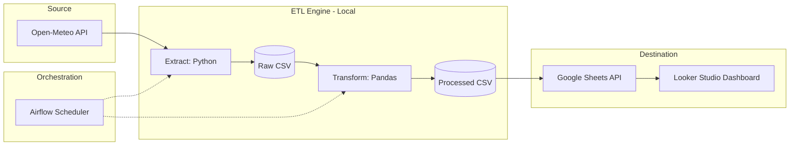
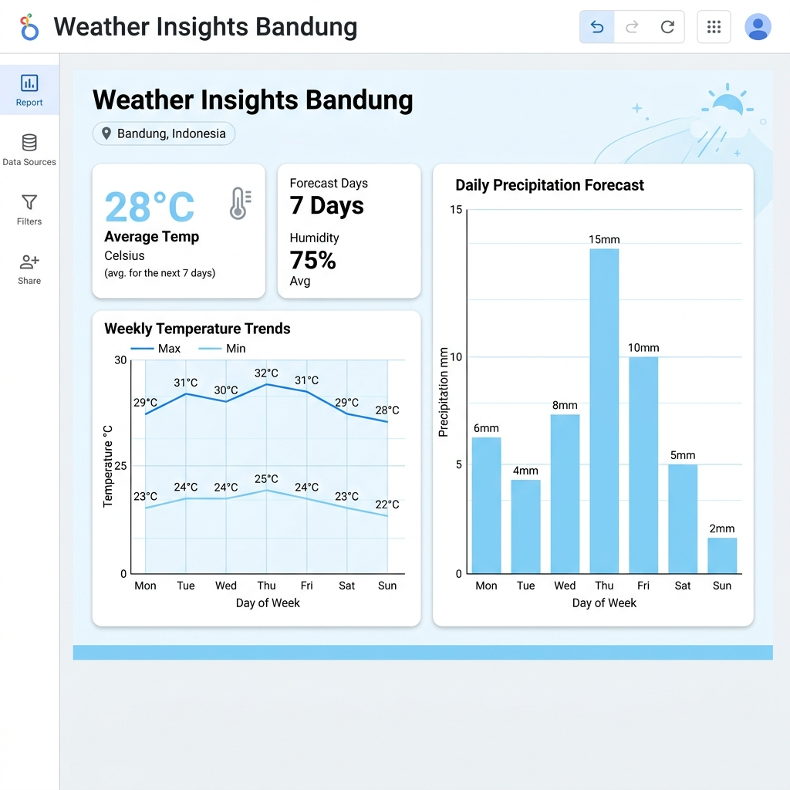

# 🌦️ WeatherDataOps: Automated Weather Insights Pipeline

[](https://www.python.org/downloads/)
[](https://airflow.apache.org/)
[](https://pandas.pydata.org/)
[](https://opensource.org/licenses/MIT)

An end-to-end data engineering pipeline that automates the extraction, transformation, and visualization of weather forecast data for **Bandung** and other major cities in **Indonesia**. Built for sustainability and scalability on local infrastructure (Mac M1/M2).

---

## 🏗️ Architecture Overview

The pipeline follows a modern batch ETL pattern, staged locally and synchronized with cloud-based BI tools.



## 🛠️ Tech Stack
- **Languages:** Python 3.11 (Pandas, Requests)
- **Orchestration:** Apache Airflow (Standalone) / n8n
- **Storage:** Local Flat Files (CSV) & Google Sheets (Cloud Interface)
- **Visualization:** Google Looker Studio
- **API:** [Open-Meteo](https://open-meteo.com) (Free, no-auth)

## 📊 Dashboard Preview

*Figure 1: Sample Looker Studio Dashboard showing 7-day trends for Bandung.*

## 🚀 Key Insights Enabled
- **Local Climate Resilience:** Early warning system for "Heavy Rain" events in Bandung.
- **Agricultural Planning:** Predictive daily temperature ranges for optimized crop cycles.
- **Regional Comparison:** Scalable architecture to compare Bandung's climate with Jakarta, Surabaya, etc.

## 📖 Deep-Dive Documentation
For detailed technical breakdowns, please visit the `/docs` folder:
- 📡 [**Data Source**](docs/data_source.md): API contracts and city configurations.
- 📐 [**Pipeline Design**](docs/pipeline_design.md): Deep dive into architecture.
- 🧪 [**Transformation**](docs/transformation.md): Business logic and feature engineering.
- ⚙️ [**Orchestration**](docs/orchestration.md): Setting up Airflow on macOS M1.
- 🎨 [**Visualization**](docs/visualization.md): Looker Studio setup guide.
- 📝 [**Assumptions**](docs/assumptions.md): Constraints and design philosophy.

## 💻 How to Run Locally (Mac M1)

### 1. Prerequisites
Ensure you have Python 3.11+ installed.
```bash
pip install -r requirements.txt
```

### 2. Manual Run
Test the ETL scripts immediately:
```bash
python3 scripts/extract.py
python3 scripts/transform.py
```

### 3. Orchestrated Run (Airflow)
```bash
export AIRFLOW_HOME=~/airflow_project
airflow standalone
# Link the DAGs
ln -s $(pwd)/dags $AIRFLOW_HOME/dags
```
Access the UI at `http://localhost:8080` to trigger `weather_forecast_pipeline_v1`.

---
*Created by [Your Name] as a Portfolio Project.*
